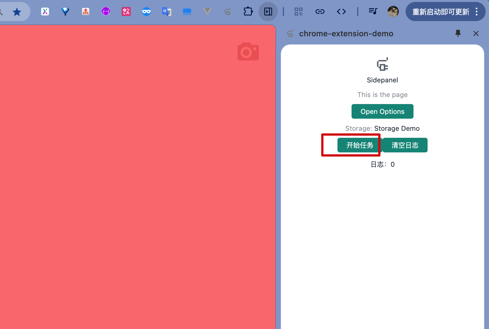
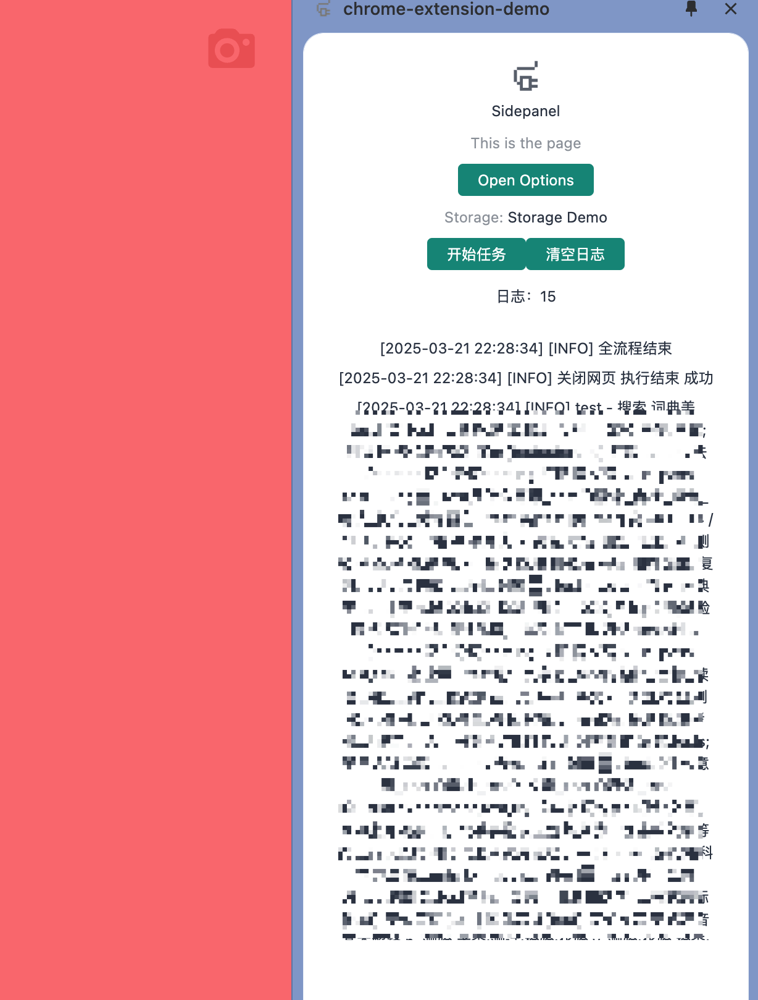

# Chrome extension template

基于 [vitesse](https://github.com/antfu-collective/vitesse) 改造，新增一些功能：

1. 替换消息通知功能
2. 基于配置流程控制网页操作
3. 拦截页面的网页请求
4. 日志模块

整个模板的框架基本没变，还是沿用 vitesse 的代码，主要新增了一些常用的功能组件。上述功能都封装到 [chrome-extension-tools](https://github.com/rni-l/chrome-extension-tools) 里，感兴趣的朋友们可以看看。

## 安装

```shell
# node >= 18
git clone git@github.com:rni-l/chrome-extension-demo.git
cd chrome-extension-demo
pnpm i
```

## 快速使用

运行 `pnpm run dev`

1. 安装浏览器插件
2. 打开插件
3. 点击“开始任务”



4. 效果：



## 简易说明

整体的项目结构和 vitesse 基本一致，整个模板只是添加了一些自动化业务常用的功能。

### 消息通信

浏览器的消息通信由三个部分组成：

1. service(background) -> sv
2. content script -> cs
3. popup/sidePanel(后面称 sidePanel) -> sp

每个浏览器插件，只会各有一个 service 和 sidePanel，会有多个 content script，所以关于 content script 的通信，都需要带上对应的 tabId，保证 background(sidePanel) 可以给指定的 content script 发消息。

### 发送和接收的数据结构

```typescript
// send
const result = await sendMsgByCS(messageId, data, { destination: CetDestination.BG , tabId?: ...})
// receive
onMsgInBg(messageId, (data, params) => {
  return xx
})

export interface CetMessageCallbackParams {
  tabId?: number
  option: CetDestinationOption
  messageId: string
}
export interface CetMessageSendResult<T = unknown> {
  data: T
  tabId?: number
  messageId: string
  success: boolean
  msg?: string
}

```

### background 发给 content script

Background 发给 content script 需要带上 tabId 才能指定发给谁：

```typescript
import { sendMsgByBG, CetDestination } from 'chrome-extension-tools'
const res = await sendMsgByBG('test1', { ... }, { tabId: tabId, destination: CetDestination.cs })
```

### background 发给 side panel

```typescript
import { sendMsgByBG, CetDestination } from 'chrome-extension-tools'
const res = await sendMsgByBG('test1', { ... }, { destination: CetDestination.sp })
```

### side panel 发给 background

```typescript
import { sendMsgBySP, CetDestination } from 'chrome-extension-tools'
const res = await sendMsgBySP('toBg', { ... }, { destination: CetDestination.BG });
```

### side panel 发给 content script

Side panel 发给 content script 需要带上 tabId 才能指定发给谁：

```typescript
import { sendMsgBySP, CetDestination, EVENTS } from 'chrome-extension-tools'
const  { data } = await sendMsgBySP(EVENTS.SP2BG_GET_CURRENT_TAB, undefined, { destination: CetDestination.BG });
const res = await sendMsgBySP('test1', { ... }, { estination: CetDestination.CS, tabId: tabId })
```

content script 监听：

```typescript
import { onMsgInCS } from 'chrome-extension-tools'
onMsgInCS('test1', async (res) => {
  console.log('test1', res)
  return 'ok'
})
```

### content script 发给 background

content script 发送给 background，可以不带 tabId

```typescript
import { sendMsgByCS } from 'chrome-extension-tools'
const res = await sendMsgByCS('test2', { name: 'task1' }, { destination: CetDestination.BG })
```

### content script 发给 side panel

content script 发给 side panel：

```typescript
import { CetDestination, sendMsgBySP } from 'chrome-extension-tools'
const { data } = await sendMsgByCS('test3', undefined, { destination: CetDestination.SP })
```

side panel 监听：

```typescript
import { CetDestination, onMsgInSP } from 'chrome-extension-tools'
onMsgInCS('test3', async (res) => {
  console.log('test3', res)
  return 'ok'
})
```

### 日志模块

日志模块提供了一个统一的日志记录系统，支持多级别日志、日志缓存、跨进程同步等功能。

组件库内已经默认初始化一个 logger，它会收集内置的消息通知：

```typescript
import { CetLogLevel, CetLogger } from 'chrome-extension-tools'

export const cetLogger = new CetLogger({
  isCS: true,
  isSP: true,
  isSyncToBG: true,
  isSyncToSP: true,
  level: CetLogLevel.DEBUG,
})
```

具体文档，查看 [chrome-extension-tools](https://github.com/rni-l/chrome-extension-tools?tab=readme-ov-file#%E6%97%A5%E5%BF%97%E6%A8%A1%E5%9D%97)

### 捕获请求

需要通知 background 注入 script 到 content script：

```typescript
// background
export function injectRequest(js: string[], match: string[]) {
  chrome.scripting.registerContentScripts([
    {
      id: 'dddd',
      js,
      world: 'MAIN', // 注意，需要这个配置
      matches: match,
    },
  ])
}
```

可以在 sp 或 bg 添加事件，来获取接口：
```typescript
// sp 监听
onMsgInSP(EVENTS.CS2SP_GET_REQUEST, async (data) => {
  console.log('data', data)
  return true
})
// bg 监听
onMsgInSP(EVENTS.CS2BG_GET_REQUEST, async (data) => {
  console.log('data', data)
  return true
})
```

工作流配置：
```typescript
[
  // 伪代码
  {
    name: 'test',
    spBeforeFn: async () => {
      // 通知 background 注入 script
      await sendMsgBySP(EVENT_INJECT_INTERCEPT_SCRIPT_SP2BG, {}, { destination: CetDestination.BG })
      // 注入完成后，需要让页面进行刷新，才能生效
      await sendMsgBySP(EVENT_RELOAD_SP2BG, {}, { destination: CetDestination.BG })
      return {
        next: true,
      }
    },
    spAfterFn: async (params) => {
      const result = await sendMsgBySP<{ tabId?: number }, boolean>(
        // 可以通过该事件，来监听 tab 状态是否完成，再执行下一步
        EVENT_CHECK_TAB_STATUS_SP2BG,
        { tabId: params.tabId },
        { destination: CetDestination.BG },
      )
      return {
        next: !!result.data,
      }
    },
  },
]
```
